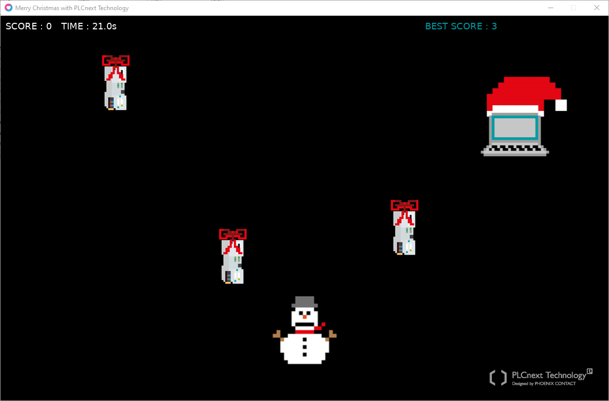

# PLCnext Christmas Game

[](LICENSE)
[](https://www.phoenixcontact.com/plcnext)
[](https://www.plcnext-community.net)

## Introduction

Welcome! Here you can find a little PLCnext Christmas Game - have fun with installing and playing.

The game in this repository was programmed with Lua and can be started directly on your PC. For this you only need to install [LÖVE - Free 2D Game Engine (love2d.org)](https://love2d.org/). It allows to run the *PLCnextChristmasGame.love* file found here directly on your computer.

Alternatively, you can also host the game on your PLCnext Control. It can then be provided as a browser game.
In this case, love.js is required, which is LÖVE ported to the web using Emscripten. 

The following instructions will explain how to get love.js running on the AXC F 2152 and finally how to access the game via web browser.



## Example details

|Description |Value  |
| --- | --- |
|Controller |AXC F 2152 |
|FW |2020.6 or later |

## Preconditions

- AXC F 2152 with SD card and firmware 2020.6 or later
-	Internet access for the PLC

## Installation steps


### Installation of balenaEngine

Install the Docker balenaEngine on the AXC F 2152 as PLCnext App -> [PLCnext Store | balenaEngine-DockerForIOT-ARM](https://www.plcnextstore.com/963)


### Installation of Node.js

A prerequisite for the next step is that your PLCnext Control has an Internet connection. Then run the "node-installation.sh" script provided here to install Node.js as a Docker container:

```
./node-installation.sh
```
The script will create the folder /opt/plcnext/projects/node-data that is used as shared folder with the container. For external communication port 8000 is defined. This can be adjusted in the shell script if required.

If all went well, you shouldn’t see any error and Node.js welcomes you.


### Installation of love.js

Create a new PuTTY session and run `balena-engine exec -it node /bin/sh` to attach the container console.
Now you can install love.js via `npm install -g love.js`


## Game integration

To run the game provided in this repository, copy the *PLCnextChristmasGame.love* file, e.g. via WinSCP, to /opt/plcnext/projects/node-data/MyGames.

Alternatively, you can also develop your own game. For this, the programming language Lua can be used, which is an easy-to-learn and often used scripting language in the gaming world. You will find a lot of information and tutorials in the Internet. An overview of framework-related functions and a short introduction can also be found here: [LOVE (love2d.org)](https://love2d.org/wiki/Main_Page), or see the link list at the end of this description. After completing the programming, zip the source files of the game in such a way that the "main.lua" is on top level in the archive directory. Then change the file extension from *.zip* to *.love*  and store this file on your PLC in /opt/plcnext/projects/node-data/MyGames.


### Generating JavaScript code

Open the PuTTY window where you have access to the Node.js container console. Here run: 

```
cd data/MyGames
love.js PLCnextChristmasGame.love game -t 'PLCnext Christmas Game' -c
cd game
python3 -m http.server 8000
```
The game is now accessible in a web browser via port 8000.

## Starting the game in a web browser

In the browser you can enter the URL `http://ip.of.the.plc:8000` to start the game.

**Please note** that it is not supported by all web browsers. But e.g., 
- Firefox Version 87.0 (64-bit) or 
- Microsoft Edge Version 96.0.1054.43 

can be used.


## Additonal information

### How to leave the container console?
To exit the container console, you can simply run `exit` .

### How to stop and start the Node.js container?
To stop the Node.js container, use the following command: `balena-engine stop node` \
To start, execute: `balena-engine start node`

### How to deploy an already generated game?
If the JavaScript code is already available, so the game is in the required format, you can also start the HTTP server directly via Python. There is no need to start Node.js and to attach its container console first. Instead just change to the directory of the game and then execute the following command as admin: `python3 -m http.server <port_number>` .

### Where to find more information?
The Internet is full of good tutorials and information about game devolopment with LÖVE. Here you can find a selection of some useful links:
-	[LOVE (love2d.org)](https://love2d.org/wiki/Main_Page)
-	[Building love2d games for the web with love.js and Docker (kalis.me)](https://kalis.me/building-love2d-games-web-docker/)
-	[GitHub - Davidobot/love.js: LÖVE ported to the web using Emscripten, updated to the latest Emscripten and LÖVE (v11.3)](https://github.com/Davidobot/love.js/)
-	[Make games quickly with LÖVE - YouTube](https://www.youtube.com/watch?v=u6GWjojPQiM)
-	[MAKING A GAME In 3 Easy Steps Using Love2D & Lua (1/3) - YouTube](https://www.youtube.com/watch?v=qA267wyXHeU)
-	[MAKING A GAME In 3 Easy Steps Using Love2D & Lua (2/3) - YouTube](https://www.youtube.com/watch?v=3CRIhC_2wTI)
-	[MAKING A GAME In 3 Easy Steps Using Love2D & Lua (3/3) - YouTube](https://www.youtube.com/watch?v=QWoRboCnsuo)


## Feedback

Provide information how feedback can be given e.g.:

* Ask a question in our [Forum](https://www.plcnext-community.net/index.php?option=com_easydiscuss&view=categories&Itemid=221&lang=en).
* Request a new feature on [GitHub](CONTRIBUTING.md).
* Vote for [Popular Feature Requests](https://github.com/PLCnext/PLCnextGame/issues?q=is%3Aopen+is%3Aissue+label%3Afeature-request+sort%3Areactions-%2B1-desc).
* File a bug in [GitHub Issues](https://github.com/PLCnext/PLCnextGame/issues).

## License
  
Copyright (c) Phoenix Contact Gmbh & Co KG. All rights reserved.

Licensed under the [MIT](LICENSE) License.

